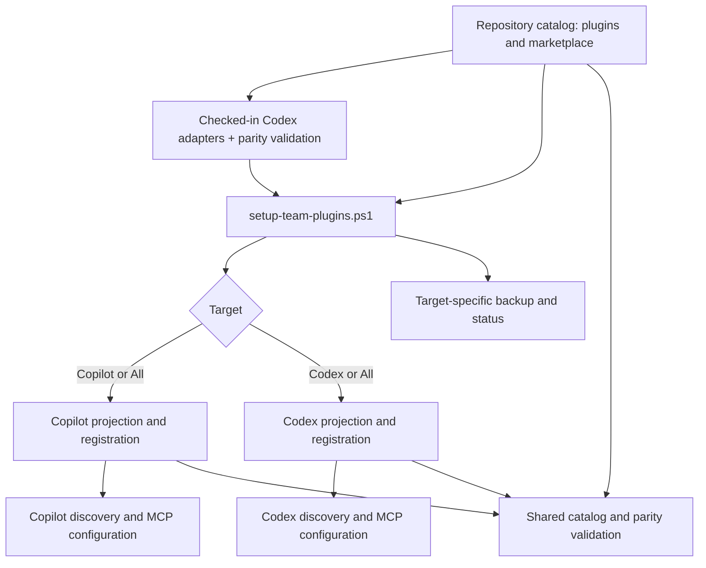

## Context

The repository has five plugin roots under `plugins/`, a Copilot/Claude marketplace manifest, MCP definitions for Fabric and Power BI, and host-specific agent files under plugin `agents/` directories. The existing `setup-team-plugins.ps1` contains installer-time Markdown-to-TOML conversion for Codex agents. Codex and Copilot can share the catalog's skills, references, scripts, templates, and MCP definitions, but each harness has independent discovery and configuration conventions; Codex agent adapters therefore need to be packaged and validated as repository artifacts.

The design keeps `plugins/**` authoritative and extends the existing setup entry point instead of maintaining a separate Codex installer. Exact Codex destinations and configuration shapes must be confirmed against the installed runtime. The workflow must work without administrator rights and must never overwrite unrelated user configuration.

## Goals / Non-Goals

**Goals:**

- Provide one setup entry point with explicit `Codex`, `Copilot`, and `All` targets, defaulting to `All`.
- Process the shared source catalog once per run and project it to each selected harness.
- Package a checked-in Codex `.toml` adapter for every supported top-level agent Markdown source and verify the pair before installation.
- Keep target-specific destinations, backups, registration, validation, and failures safely scoped within the unified run.
- Give agents and users the same documented target-selection and verification commands.

**Non-Goals:**

- Duplicating or independently maintaining platform-neutral domain content for Codex.
- Making one harness depend on the other's discovery locations or configuration.
- Making Codex emulate unsupported Copilot plugin commands or marketplace behavior.
- Generating or authoring Codex agent adapters during user setup.
- Automatically modifying project-level `AGENTS.md` files in user repositories.

## Architecture Diagram

## Decisions

### Use one target-selecting setup entry point

Extend `setup-team-plugins.ps1` with `-Target Codex|Copilot|All`, defaulting to `All` when omitted. One run resolves the repository and catalog once, then performs the required discovery and MCP registration for each selected harness. It reports status per target; a failure in one target cannot overwrite, remove, or misreport the other's installation.

Alternative considered: separate Codex and Copilot setup scripts. This isolates code paths but duplicates repository discovery, catalog validation, parameter documentation, and team instructions. A target dispatcher keeps the public workflow coherent while retaining isolated host-specific functions internally.

### Keep the repository catalog as the single content source

The marketplace list and filesystem enumeration define the supported plugin inventory. Skills, references, scripts, templates, top-level agent Markdown role instructions, checked-in Codex `.toml` adapters, and `.mcp.json` definitions remain under `plugins/**`. Codex-specific discovery, role-invocation, or MCP-registration adapters are allowed only when the installed runtime demonstrably requires them.

Parity validation SHALL map every installed asset to its source artifact and reject an omitted catalog item, an unresolved reference, a missing/stale checked-in agent adapter, or an undeclared adapter. It SHALL not require a Codex-specific copy of domain guidance when the source artifact is directly usable.

### Keep Codex agent adapters as checked-in artifacts

Each packaged top-level agent Markdown file that is exposed to Codex SHALL have a corresponding checked-in `.toml` adapter in the plugin's `agents/` directory. The adapter SHALL carry the Codex-native metadata and the source agent's specialist instructions, while the Markdown file remains the source artifact for Copilot/Claude-compatible behavior. Validation SHALL compare the adapter's instruction payload and identity mapping with its source agent and SHALL fail on missing, stale, or orphaned adapters.

The Codex setup projection SHALL copy the checked-in `.toml` adapter to the Codex agent directory. It SHALL NOT parse Markdown, synthesize TOML, or silently repair an adapter during installation. This keeps release contents deterministic and makes adapter changes reviewable in version control.

Alternative considered: generate `.toml` files in `setup-team-plugins.ps1`. This reduces checked-in duplication, but makes the installed result dependent on PowerShell conversion behavior and hides host-specific changes from review; it is rejected.

### Isolate target-owned state and configuration

Each target resolves only its runtime-supported user-scoped destinations, records its own ownership marker or manifest, and creates timestamped backups before replacing target-owned files. The installer preserves unrelated skills, agent instructions, servers, and settings. MCP registration derives from the existing `.mcp.json` definitions and must define how same-name user-owned server entries are detected and handled without silent overwrite.

### Keep target selection explicit for users and agents

Documentation and agent instructions SHALL identify `-Target Codex`, `-Target Copilot`, and `-Target All`, their required prerequisites, their verification steps, and their recovery paths. When a user asks an agent to install the collection, the agent must identify the requested harness or ask which target is wanted; it must not infer that one harness installation configures the other.

### Treat optional tooling as capability- and target-scoped

Node/npm, `uv`, Power BI Desktop Bridge, ADOMD.NET, and VS Code's Python extension are checked or provisioned only when the selected plugin and target require them. Missing optional tooling produces a warning and remediation; missing required tooling or invalid target MCP registration produces a failing status for that target.

### Protect and replace only installer-owned MCP blocks

Codex registration treats the ownership marker and the complete named server block as one managed
unit. It recognizes markers written immediately before the server section as well as markers inside
the matched block, removes only a marked block during a forced update, and rejects an unmarked
same-name server. This preserves user-owned configuration while allowing repeatable updates.

### Validate at three levels

1. Static catalog validation enumerates every plugin, skill, agent, reference, script, and MCP definition and verifies its source-to-projection mapping.
2. Installer tests exercise `Codex`, `Copilot`, the default `All`, and explicit `All`, plus selected-plugin, force, invalid input, missing repository, backup, collision, and failure paths in isolated temporary user profiles.
3. Host regression checks confirm each target's registration behavior remains correct and that its configuration changes leave the other target's files and configuration untouched.

## Risks / Trade-offs

- [Codex discovery or MCP configuration changes] → Detect the installed runtime's supported paths/schema, validate against it, document the resolved paths, and fail with remediation when the runtime is too old or unavailable.
- [A shared dispatcher regresses established Copilot behavior] → Preserve its explicit `-Target Copilot` semantics and run its existing validation as a regression suite.
- [An `All` run partly fails] → Use target-owned backups and status; report per-target outcomes and recovery commands without rolling back a successful completed target operation.
- [An existing MCP server has a managed name] → Detect the owner and require an explicit safe update path rather than overwriting an unknown user entry.
- [An adapter drifts from its source artifact] → Keep adapters declarative and thin, validate the instruction payload against the paired agent Markdown file, and fail setup validation before projection.

## Migration Plan

1. Add and validate checked-in Codex `.toml` adapters for the packaged top-level agents, then remove installer-time Markdown-to-TOML conversion.
2. Refactor the existing setup script behind a target dispatcher, defaulting no-argument setup to `All` while retaining explicit Copilot behavior.
3. Add the Codex target projection, registration, ownership marker, and validation based on the installed Codex runtime.
4. Test each target selectively, then test default and explicit `-Target All` with an injected one-target failure and existing user configuration.
5. Publish direct and agent-guided setup, verification, update, and recovery commands for every target, including the checked-in adapter maintenance rule.
6. Roll back a target by removing only that target's installer-owned projection/manifest and restoring its latest backup; the other target remains unaffected.
