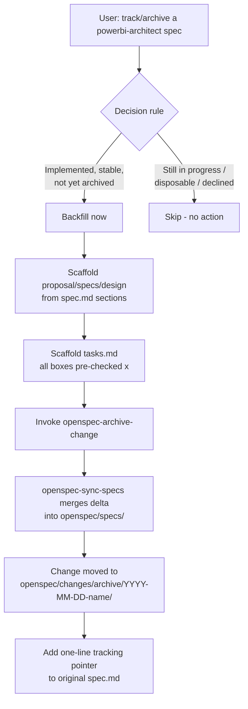

## Context

`plugins/spec-lifecycle/skills/openspec-bridge/SKILL.md` already exists and defines a two-outcome
decision rule (adopt ongoing tracking: yes/no) plus a single "adopt tracking" workflow that
scaffolds an OpenSpec change and leaves it open. It never archives anything, so it has no path for
turning already-completed, unarchived `powerbi-architect` specs into a historical record — see
`proposal.md` for why that gap matters. Per user feedback, the "ongoing tracking" outcome is
itself unneeded overhead: this skill is a supplement for recording finished work, not a parallel
change-management system to run alongside a spec still being revised in place (the spec.md is
already the source of truth during active work). This design replaces the existing workflow
entirely with a single backfill-on-completion workflow. It does not touch `plugins/powerbi/*` or
the OpenSpec core skills under `.agents/skills/`.

## Goals / Non-Goals

**Goals:**
- Give `openspec-bridge` a decision rule that correctly routes "implemented and stable, not yet
  archived" specs to a backfill action instead of "no action."
- Add a backfill workflow that produces a real historical archive entry
  (`openspec/changes/archive/YYYY-MM-DD-<name>/` + synced `openspec/specs/` delta) in one pass,
  without leaving an intermediate open change behind.
- Remove the "adopt ongoing tracking" outcome and workflow entirely — a spec still being revised
  stays a plain `specs/<Name>.spec.md`, with no parallel OpenSpec change to keep in sync.

**Non-Goals:**
- Migrating every existing flat spec in any repo automatically — the decision rule still requires
  identifying the specific spec, per skill guidance.
- Changing `powerbi-architect.agent.md` or any file under `plugins/powerbi/*`.
- Building new OpenSpec CLI functionality — the backfill workflow only orchestrates existing
  `openspec` CLI commands and the repo's existing `openspec-archive-change`/`openspec-sync-specs`
  skills.

## Architecture Diagram

## Decisions

**Decision 1: The bridge has a single workflow — backfill-on-completion — replacing the prior
"adopt tracking" workflow rather than adding backfill alongside it.** Keeping two workflows (one
that leaves a change open, one that archives immediately) would require maintaining two copies of
the section-to-artifact mapping and would reintroduce the overhead this change removes: a parallel
OpenSpec change tracked alongside a spec.md still being edited in place. Alternative considered:
keep both workflows and let the user choose — rejected per user feedback that "ongoing tracking"
is unneeded overhead for a supplement mechanism whose only job is recording finished work.

**Decision 2: The backfill workflow hands off to the repo's `openspec-archive-change` skill rather
than assuming a bare `openspec archive` CLI verb.** `openspec-archive-change` already implements
the sync-before-move gating, task/artifact completion checks, and date-prefixed folder naming.
Reimplementing that logic inside `openspec-bridge` would risk diverging from the real contract
(e.g. archiving before a sync failure is resolved). Alternative considered: call `openspec archive`
directly from the bridge — rejected because it bypasses the archive skill's validation/sync
sequencing that the rest of the repo relies on.

**Decision 3: Backfilled `tasks.md` is scaffolded with every checkbox pre-checked `[x]`, not a
verbatim copy of the source spec's checkbox state.** Confirmed with the user: checkboxes are meant
to reflect real state. A backfilled change represents already-finished work, so leaving boxes
unchecked would make `openspec-archive-change`'s incomplete-task warning fire spuriously and would
misrepresent history. Alternative considered: preserve the source spec's literal checkbox state —
rejected as historically inaccurate for a "the work is done" backfill.

## Risks / Trade-offs

- **Risk**: A backfilled spec's Requirements section may not map cleanly to OpenSpec's ADDED/
  MODIFIED/REMOVED/RENAMED delta format if the source spec was written loosely. → **Mitigation**:
  the workflow instructs treating everything as `ADDED Requirements` for a first-time backfill
  (there is no existing main spec to diff against), matching the "new capability" case in
  `openspec-sync-specs`.
- **Risk**: Running the real archive handoff during dogfooding could fail partway (e.g. `openspec
  validate --strict` catching a malformed delta) and leave an orphaned half-archived change. →
  **Mitigation**: the dogfood step in `tasks.md` runs `openspec validate --strict` before invoking
  archive, and archive itself stops on sync failure without moving the folder — no user action
  needed to recover partway states, per `openspec-archive-change`'s existing contract.
- **Trade-off**: Restricting this change to fixing `openspec-bridge`'s SKILL.md (no automated
  tests) means correctness is verified by one manual dogfood pass, not a repeatable test suite.
  Accepted because `openspec-bridge` has no existing test harness and adding one is out of scope
  for this change.
