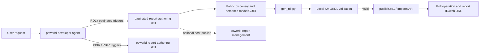

## Context

The existing Power BI plugin is organized under `plugins/powerbi`, with separate skills for semantic-model work, interactive PBIR/PBIP authoring, report management, and planning. PR #65 was fetched from the local `skills-for-fabric` clone at commit `1e42d58`; it is self-contained under a top-level `skills/paginated-report-authoring` directory and includes documentation plus `gen_rdl.py` and `publish.ps1`. Its relative links and generic skill metadata assume the upstream repository layout, so they require adaptation before being placed in this plugin.

## Goals / Non-Goals

**Goals:**

- Add a maintainable paginated-report skill with the PR's RDL/DAX/publishing knowledge and scripts.
- Make routing unambiguous between RDL paginated reports, interactive PBIR/PBIP reports, semantic-model discovery, and post-publish report management.
- Keep generation reproducible, offline-testable, and safe for authenticated Fabric operations.
- Preserve upstream attribution/provenance in the skill documentation or repository contribution notes.

**Non-Goals:**

- Do not merge or rewrite the current repository's existing interactive report-authoring skill.
- Do not add a new paginated-report visual format to PBIR/PBIP.
- Do not perform a live Fabric publication as part of the repository integration.
- Do not introduce a new MCP server or hardcode tenant, workspace, semantic-model, or credential values.

## Architecture Diagram

## Decisions

### Place the skill inside the Power BI plugin

Copy the PR's skill content into `plugins/powerbi/skills/paginated-report-authoring/`, retaining its reference and script grouping. Adapt upstream `../../common` links to this repository's `common` location or the plugin's supported skill-link convention, and use this repository's skill frontmatter and naming conventions. This makes installation through the Power BI plugin include the capability automatically.

Alternative considered: vendoring the skill at repository root or under the Fabric plugin. Rejected because the artifact is a Power BI report workflow and the current plugin architecture owns Power BI skills under `plugins/powerbi`.

### Keep RDL authoring separate from PBIR authoring

Use explicit trigger terms such as `paginated report`, `RDL`, `tablix`, `publish rdl`, and `InvalidDefinitionFormat`. Add a concise routing note to `powerbi-developer` and the Power BI README. Keep PBIR/PBIP terms and mechanics in `powerbi-report-authoring`; share semantic-model discovery and post-publish governance by reference rather than duplicating those skills.

Alternative considered: expand `powerbi-report-authoring` to cover both formats. Rejected because RDL has different schemas, generation, publishing APIs, and validation failure modes, and combining them would make routing and maintenance less clear.

### Preserve the PR's two-stage authoring and publication model

The generator will produce RDL from explicit model/report inputs and perform local well-formedness checks. Publication will use the PR's preferred Power BI Imports API path, with the Fabric definition API documented as an alternate where appropriate. The workflow will discover the semantic-model GUID before generation, use token-based authentication, poll long-running operations, and report identifiers/URLs without logging tokens.

Alternative considered: use only the Fabric paginated-report definition API. Rejected because PR #65 documents strict `InvalidDefinitionFormat` behavior for hand-authored RDL and recommends Imports API fallback.

### Test at the repository boundary

Add tests that run without Fabric access: generator input/output and XML parsing, required RDL structure/field mappings, secret-redaction or no-secret guarantees, and skill/agent trigger discoverability. Keep live API publication as an opt-in integration test requiring explicit credentials and workspace configuration.

## Risks / Trade-offs

- [Upstream drift] → Record the source PR/commit and review future upstream changes explicitly; do not silently overwrite local adaptations.
- [RDL schema strictness and blank rendering] → Preserve required namespace/element ordering guidance, validate locally, and test bracketed/qualified `<DataField>` mappings.
- [API behavior varies by tenant/capacity] → Keep Imports API as the preferred path, poll terminal states, document capacity/permission prerequisites, and make live publishing opt-in.
- [Authentication leakage] → Use Azure CLI/environment authentication, prohibit embedded credentials, redact diagnostics, and test generated files/logging for token-like values.
- [Tool availability] → Detect missing Azure CLI, Python, PowerShell, or `jq` and report installation guidance before attempting generation or publication.

## Migration Plan

1. Add the adapted skill files and scripts under the Power BI plugin.
2. Update agent routing, README capability tables, and any plugin metadata or tests that enumerate skills.
3. Run offline tests, skill validation, and repository documentation checks.
4. Install/reload the local Power BI plugin and verify trigger selection with representative RDL and PBIR prompts.
5. Roll back by reverting the new skill, routing, documentation, and tests; existing interactive report workflows remain intact.

## Open Questions

None that change the proposed requirements or architecture. The exact final wording of shared `common` references can be resolved during implementation after confirming the installed skill packaging behavior.
