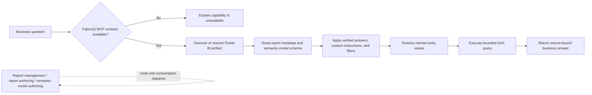

## Context

The local Fabric plugin currently offers a broad `fabric-mcp-server` configuration and a `fabric-cli` skill, but it has no dedicated FabricIQ consumption skill or verified FabricIQ tool contract. The latest reference `fabric-skills` plugin includes the FabricIQ skill as an additive capability. Microsoft recommends using that skill together with the FabricIQ MCP server; the skill orchestrates the read-only Power BI tools supplied by the MCP server. Local adaptation is needed only for the repository's plugin structure and documentation links.

## Goals / Non-Goals

**Goals:**

- Add an installable, versioned FabricIQ consumption skill only after its MCP contract is verified.
- Establish reliable routing between data consumption, PBIR authoring, report management, and semantic-model authoring.
- Preserve model governance by prioritizing verified answers, custom instructions, and report filter context.

**Non-Goals:**

- Adding FabricIQ ontology authoring or graph traversal.
- Replacing `fabric-cli` for Fabric item management or deployment.
- Implementing a query engine, semantic model, or report changes as part of this proposal.

## Decisions

### Use the supplied HTTP FabricIQ endpoint and gate routing on its contract

The Fabric plugin MCP configuration will add a `FabricIQ` server alongside the existing `fabric-mcp-server`, using `https://api.fabric.microsoft.com/v1/mcp/fabriciq` with all server-provided tools enabled. The implementation will verify that the endpoint exposes the required read/query operations before adding routing redirects. This prevents the broken-routing problem in the reference report-management text.

The verified local contract exposes six read-only operations: artifact discovery,
artifact resolution, report metadata, semantic-model schema, value search, and
DAX execution. Artifact resolution is provided by `FabricIQ-ResolveFabricItem`;
there is no separate report-ID URL resolver. A supported URL can resolve
directly to a semantic model, so routing must honor the returned `itemType`.

Alternative considered: import the reference `SKILL.md` immediately and configure the endpoint later. Rejected because the resulting skill would prescribe tools that are unavailable to Codex.

### Place FabricIQ consumption in the Fabric plugin

The capability belongs under `plugins/fabric/skills/fabriciq` because its primary concern is querying live Fabric/Power BI artifacts. Power BI authoring skills will retain their narrow responsibilities and provide a companion-skill redirect only after availability verification.

Alternative considered: add it under `plugins/powerbi/skills`. Rejected because the tool connection, installation, and runtime service are Fabric-platform concerns rather than PBIR or semantic-model authoring mechanics.

### Port the latest FabricIQ skill as an additive, source-aligned capability

The local skill will retain the latest reference's core discovery, verified-answer, custom-instruction, value-resolution, filter-preservation, and source-bound rules. It is additive to the broader Fabric skills migration, not a replacement for it. The port will replace only references to unavailable shared documentation with local documentation or self-contained routing guidance, and add local semver metadata.

Alternative considered: copy the skill unchanged. Rejected because its relative common-document links and unverified tool names would be invalid in this repository.

## Architecture Diagram

## Risks / Trade-offs

- [FabricIQ MCP is not available in supported Codex environments] → Treat MCP verification as the first implementation task and stop the rollout if the contract cannot be established.
- [Codex OAuth issuer discovery is incompatible with Microsoft Entra metadata] → Keep the endpoint unchanged, document the supported `FABRICIQ_TOKEN` bearer-token fallback, and allow a working Copilot connection to proceed independently.
- [Reference tool names or response shapes differ from the local endpoint] → Use `tools/list` at runtime as authoritative, then test the discovered contract with a representative report and semantic model.
- [Query answers can violate business semantics] → Require full schema review, verified-answer priority, custom-instruction compliance, filter preservation, and value lookup before generating filters.
- [Routing overlap with existing Fabric CLI guidance] → Document the distinction: FabricIQ answers business questions; `fabric-cli` manages and automates Fabric resources.

## Migration Plan

1. Add the supplied `FabricIQ` HTTP server entry to the Fabric plugin configuration without replacing the existing server.
2. Verify the endpoint's required operations in Codex and confirm tenant access with a read-only smoke test.
3. Add the adapted, versioned `fabriciq` skill and its local documentation.
4. Validate routing and representative read-only query scenarios.
5. Update the report-management and semantic-model-authoring redirects only after successful validation.
6. Roll back by removing the new routing redirects and disabling the FabricIQ MCP registration; existing report and model workflows remain unchanged.
