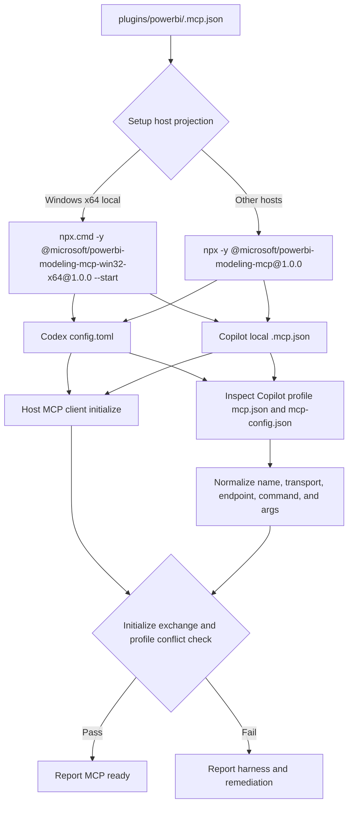

## Context

The Power BI plugin declares its MCP server as an `npx` launch of the generic `@microsoft/powerbi-modeling-mcp` package. On Windows, version 1.0.0 attempts to auto-install its platform package by calling `execFileSync("npm", ...)`; Node's Windows process API does not resolve that extensionless command to `npm.cmd`, so the server exits before MCP initialization. The setup script currently copies declarations into Copilot and translates them into Codex without validating their host-specific launchability. The active Copilot profile also contains two compatibility-shaped files: `mcp.json` with `servers` and `mcp-config.json` with `mcpServers`. Both currently contain the same stale VS Code extension command, and setup does not manage either file. A separate installed Fabric skills bundle uses the canonical `powerbi-modeling-mcp` name for a hosted HTTP endpoint, so conflict detection must distinguish transport and endpoint rather than treating the name alone as proof of equivalence.

## Goals / Non-Goals

**Goals:**

- Keep the checked-in source declaration portable and explicit.
- Generate Windows Copilot and Codex commands that invoke the published Windows x64 package directly, avoiding runtime package bootstrap.
- Define `powerbi-modeling-mcp` as the canonical identity and migrate or report the legacy `powerbi-modeling` alias without deleting unowned entries.
- Remove the obsolete `--start` argument from the source declaration.
- Add deterministic setup validation and regression coverage for the generated command and failure reporting.
- Preserve safe ownership checks and unrelated user configuration.
- Inspect both Copilot profile MCP schemas and report same-name conflicts before declaring Copilot ready.
- Distinguish local stdio registrations from hosted HTTP registrations that use the same canonical name.

**Non-Goals:**

- Patch or vendor Microsoft's MCP package.
- Change the MCP protocol or Power BI Modeling tool behavior.
- Automatically delete arbitrary user-owned stale MCP entries.
- Add support for architectures other than the host's supported Windows x64 package.

## Decisions

### Architecture Diagram

### Source declaration and host projection

The source `.mcp.json` will pin the generic package version and omit `--start`, keeping the checked-in declaration portable. The published Windows x64 package requires its documented `--start` mode to bypass its interactive welcome path, so the Windows projection uses `npx.cmd -y @microsoft/powerbi-modeling-mcp-win32-x64@1.0.0 --start` in both the Codex TOML entry and the Copilot plugin-local `.mcp.json`. Other hosts retain the generic package declaration. `powerbi-modeling-mcp` is the canonical server name; `powerbi-modeling` is treated as a legacy alias only during migration and conflict detection.

The normalized MCP signature includes server name, transport, URL or command, arguments, and non-secret headers. A hosted HTTP definition with the canonical name is not equivalent to the local Windows stdio definition and is never silently replaced when it is user-owned or owned by another plugin. Two profile files containing equivalent definitions are reported as one logical conflict, not as two independent servers.

### Validation

Setup will validate Windows x64 architecture before writing the platform-specific projection, validate required executables and package provisioning separately, and perform a bounded MCP `initialize` exchange for each selected local server before reporting the target as ready. Validation will be non-mutating; it will not send destructive MCP operations. A process that stays alive but fails initialization is not ready. A failed launch or initialize exchange produces a target failure with the exact harness, server, transport, and remediation rather than a false-ready summary.

Regression tests will use an injected fake launcher or fixture package for deterministic command and failure assertions without network access. A separate Windows integration test will exercise the real pinned package and verify that the process remains alive through initialization.

For Copilot, setup will read both profile files when present, normalize their different top-level keys for comparison, and flag a same-name entry that points to a different or unavailable command. It will not remove or overwrite an unowned profile entry; remediation will identify the exact file and property to review. Installer-owned entries may be updated through the normal force-controlled path.

### Alternatives considered

- **Keep `npx @microsoft/powerbi-modeling-mcp@latest`:** rejected because it is nondeterministic and reproduces the Windows bootstrap failure.
- **Require every user to preinstall a local package manually:** rejected because it makes the setup workflow incomplete and hard to verify.
- **Use the Windows package in the shared source declaration:** rejected because the repository supports non-Windows hosts and the source catalog must remain portable.
- **Treat every same-name definition as the same server:** rejected because the installed Fabric skills bundle can provide a valid hosted HTTP registration while this setup provides a local stdio registration; transport and endpoint must be part of conflict identity.

## Risks / Trade-offs

- [Risk] The platform package may later change its package name or supported architectures. → Pin the known working version and keep the host adaptation isolated and documented.
- [Risk] A launch probe may start a process that is slow or unavailable offline. → Use a bounded initialize timeout, isolate deterministic tests behind a fake launcher, and report a failure when MCP is required for the selected target.
- [Risk] Existing stale entries may remain in user config. → Normalize both profile schemas, collapse equivalent definitions into one finding, do not delete unknown entries, and document the manual cleanup path.
- [Risk] A hosted HTTP registration shares the canonical name with the local package. → Compare transport and endpoint signatures, preserve the unowned definition, and require an explicit user choice before replacing it.

## Migration Plan

1. Update the source declaration and setup projection/validation.
2. Run the setup regression suite and a Windows launch smoke test.
3. Rerun setup with `-Target Codex -PluginName powerbi -Force` so the installer-owned canonical entry is regenerated.
4. Review any `powerbi-modeling` legacy alias and same-name hosted HTTP definition reported by setup; remove or rename it manually only when it is no longer needed, then restart Codex.
5. Roll back by restoring timestamped target backups and reverting the repository change; do not delete unowned profile files.

## Verification Handoff

- OpenSpec strict validation: passed (`openspec validate fix-windows-powerbi-modeling-mcp --type change --strict --json`).
- PowerShell parser checks: passed for `setup-team-plugins.ps1`, `scripts/test-setup-team-plugins.ps1`, and `scripts/test-powerbi-modeling-mcp-smoke.ps1`.
- Deterministic setup regression suite: passed with `scripts/test-setup-team-plugins.ps1 -RunIntegration`.
- Real Windows x64 smoke test: passed with `scripts/test-powerbi-modeling-mcp-smoke.ps1`; `@microsoft/powerbi-modeling-mcp-win32-x64@1.0.0` remained alive through the MCP `initialize` exchange using `--start`.
- Post-install verification: Copilot profile-level stale extension entries were removed from both user-owned schemas; the probe now resolves `npx.cmd` to its absolute executable path and uses a bounded 30-second initialize timeout.
