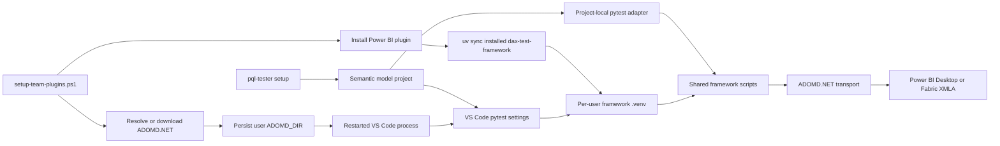

## Context

See [proposal.md](proposal.md) for motivation. Today `setup-team-plugins.ps1` downloads ADOMD.NET
to a searched per-user NuGet cache and installs the VS Code Python extension, but it neither
persists the resolved DLL folder nor creates the installed framework's `.venv`. The framework's
helper can search common DLL locations at execution time, while `pql-tester setup` currently
scaffolds only `functions.tmdl`, `MeasureCertification.csv`, and `TESTING.md`. Its documented
project-local commands refer to a `dax-test-framework` folder that is not placed in the target
semantic model project.

The solution spans the team installer, the installed Power BI plugin, the DAX scaffolder, and a
user's semantic model workspace. It must remain no-admin, preserve the existing non-fatal plugin
installation behavior, avoid checking secrets or machine-specific absolute paths into semantic
model projects, and keep one authoritative DAX execution implementation.

## Architecture Diagram

## Goals / Non-Goals

**Goals:**

- Establish one validated user-level `ADOMD_DIR` for future shells and VS Code processes.
- Provision the installed framework's locked Python environment during Power BI plugin setup.
- Give each scaffolded semantic model project a thin, discoverable pytest surface without copying
  framework implementation code.
- Preserve existing project files and unrelated VS Code settings, with explicit conflict reports.
- Keep CLI, direct pytest, and VS Code executions behaviorally equivalent.

**Non-Goals:**

- Starting or restarting VS Code on the user's behalf.
- Installing Power BI Desktop, deploying PQL.Assert, configuring CLOUD credentials, or opening a
  semantic model.
- Making Windows-only ADOMD.NET execution portable to non-Windows hosts.
- Replacing `uv`, publishing the framework as a public Python package, or globally installing its
  Python dependencies.
- Automatically rewriting a user's conflicting Python/pytest workspace configuration.

## Decisions

### Persist only a validated ADOMD DLL directory

`Install-AdomdClient` will return a structured resolution result rather than only a Boolean. The
result will distinguish a valid pre-existing override, a standard installation, a per-user cache,
and a freshly downloaded package. A separate persistence step will canonicalize the directory,
confirm the DLL exists, set `$env:ADOMD_DIR` for immediate child processes, and call the .NET user
environment API for future processes. The installer will read the value back before claiming
persistent readiness.

An invalid old value will not be deleted pre-emptively. It is replaced only after another valid
candidate is available; if resolution fails, the old persisted value is left unchanged for
diagnosis. This avoids turning a recoverable setup warning into destructive environment mutation.

Alternative considered: rely exclusively on the helper's NuGet cache search. That works for some
CLI runs but does not establish the explicit, inspectable contract requested for independently
launched VS Code Python processes.

### Select and verify the installed framework runtime deterministically

After copying the Power BI plugin to the stable discovery path, setup will run `uv sync --locked`
against that installed `dax-test-framework` directory. The environment therefore lives beside the
installed manifest as `.venv`, survives independently of a source repository checkout, and is
recreated consistently after plugin upgrades. Verification will use that interpreter to import
pytest and the framework helper without connecting to a model.

The installer will treat synchronization as non-fatal because plugin installation remains useful
when Python package feeds are temporarily unavailable. Its readiness summary must distinguish
"plugin installed" from "VS Code DAX test runtime ready."

Alternative considered: install pytest, pythonnet, and pyadomd globally. This would conflict with
the repository's per-skill isolation contract and would make results depend on the user's global
Python state.

### Use a thin project-local adapter, not a copied framework

`setup_project.py` will scaffold a small test module and pytest hook/configuration under an owned
project test path. The adapter resolves the shared framework in this order: an explicit developer
override intended for unusual installations, the repository sibling layout when running from a
source checkout, then the standard `%USERPROFILE%\.copilot\extensions\powerbi\skills\dax-test-framework`
location. It loads the framework's pytest hooks and test function while leaving transport,
discovery, smoke-gate, and error classification in the shared scripts.

The adapter defaults `--dax-model-dir` to the semantic model project's `DAXQueries` directory.
Collection imports helpers and discovers filenames only; the session fixture creates the
transport and runs the smoke gate when a test executes. This keeps VS Code discovery useful while
Desktop is closed and prevents background discovery from making external connections.

Alternative considered: copy all framework scripts into each semantic model project. That would
make projects immediately self-contained but would fork framework behavior and leave projects on
stale transport and error-classification code after plugin updates.

### Point VS Code at the provisioned per-user interpreter

Scaffolding will add the minimum Python extension settings required to enable pytest, identify the
owned local test path, and select the installed framework interpreter. Settings will use VS Code
environment expansion based on `USERPROFILE` rather than storing an absolute profile path. The
pytest arguments will refer only to workspace-relative project files; `ADOMD_DIR` arrives through
the restarted VS Code process's user environment.

If `.vscode/settings.json` exists, the scaffolder will parse it as JSON-with-comments where
practical, add absent managed keys, and preserve all unrelated keys. A differing existing managed
value is a conflict: it is reported with the desired value and left unchanged. The generated
adapter remains runnable from a terminal even when workspace settings require manual reconciliation.

Alternative considered: create a project-local `.venv`. That would require duplicating and
synchronizing dependencies for every semantic model project and would not solve how the local
adapter locates the shared framework implementation.

### Verify each boundary independently

Installer-focused tests will isolate candidate resolution and user-environment writes behind
injectable or mockable boundaries; they must not mutate the developer's real environment.
Scaffolder tests will use temporary project trees to cover first-run, rerun, partial, and settings
conflict behavior. Framework tests will exercise collection with a fake shared-framework path and
assert that collection does not construct a transport. A final Windows integration check will use
the installed `.venv`, inherited `ADOMD_DIR`, and a scaffolded fixture project; a live DEV model is
required only for the execution check, not for discovery tests.

## Risks / Trade-offs

- [A running VS Code instance does not receive user environment changes] → State this explicitly,
  set the installer process value for immediate verification, and require a VS Code restart in the
  success summary.
- [Corporate policy blocks user environment writes] → Keep the resolved process value, report that
  persistence failed, and provide a precise manual `ADOMD_DIR` command.
- [The standard plugin discovery path changes] → Centralize path resolution in the generated
  adapter and support an explicit framework-directory override for non-standard installs.
- [A user's existing pytest settings conflict] → Preserve their values, emit a structured conflict
  outcome, and keep a documented terminal command available.
- [Plugin reinstall removes the installed `.venv`] → Run locked synchronization after every
  targeted plugin copy, and do not declare VS Code runtime readiness until verification passes.
- [ADOMD package contains multiple target-framework DLL folders] → Use an explicit compatibility
  preference and validate the selected DLL through the installed Python runtime before declaring
  end-to-end readiness.
- [JSON-with-comments editing can alter formatting] → Avoid rewriting settings when no managed key
  is missing; preserve semantic content and cover merge/idempotency with fixture tests.

## Migration Plan

1. Ship installer resolution/persistence and locked runtime provisioning while retaining the
   existing NuGet-cache fallback search.
2. Ship the project-local adapter and VS Code settings templates, then extend `pql-tester setup` to
   scaffold them for new and existing projects.
3. Existing users rerun `setup-team-plugins.ps1 -PluginName powerbi -Force`, restart VS Code, and
   rerun `pql-tester setup` in each semantic model project. The scaffolder adds only missing assets
   and reports conflicts.
4. Verify pytest discovery without a running model, then execute a DEV smoke/test run with the
   semantic model open in Power BI Desktop.

Rollback removes the new project-local adapter/settings keys only when they still match generated
values, stops provisioning the installed `.venv`, and leaves a valid user `ADOMD_DIR` in place
because it remains compatible with the framework's prior discovery behavior. Users may remove that
environment variable manually if organizational policy requires it.
