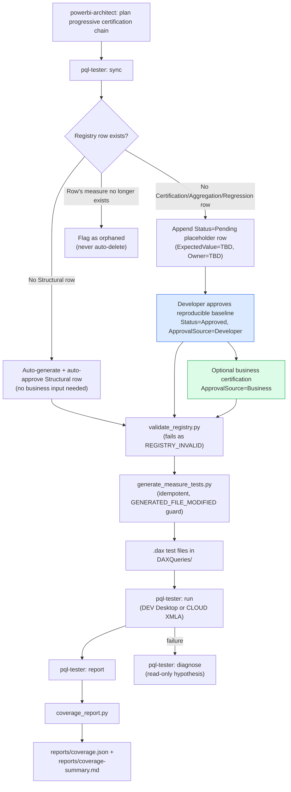

## Context

See [proposal.md](proposal.md) for motivation. This is a cross-cutting change: it adds a new skill (`dax-unit-testing`), a new agent (`pql-tester`), and modifies an existing agent's planning behavior (`powerbi-architect`), all coordinated around a shared external contract (the `Certification/MeasureCertification.csv` registry) that lives in *target* semantic model projects, not in this skills repo. The source library being integrated is PQL.Assert 0.6.0 (`C:\Development\PQL.Assert`), and the work is governed by the BI COE's GATE-001 "Measure Certification & Testing" gate, which this change supplies the reusable tooling for without implementing GATE-001's own CI/PR enforcement.

## Workflow Diagram

*The developer baseline (blue) makes a measure executable immediately. Business certification (green) is optional and additive; it never blocks baseline generation or execution. `Structural` rows remain fully automated.*

## Goals / Non-Goals

**Goals:**
- Provide a deterministic, script-backed registry contract (validate/generate/certify/coverage) that both agents and any downstream CI gate can consume identically.
- Let developers establish immediately executable, reproducible baseline tests while preserving a separately auditable, business-owned certification layer and letting agents own `Structural` coverage end-to-end.
- Make measure test planning a first-class, visible step in spec authoring (`powerbi-architect`) rather than an implicit afterthought left to `powerbi-developer`.
- Give any downstream automation a fixed, machine-readable error-type vocabulary instead of free-form failure text.

**Non-Goals:**
- Executing tests against live customer models (e.g., Glasslake) as part of this change.
- Implementing GATE-001's own CI/PR publication or blocking-merge plumbing — that is a downstream consumer's responsibility.
- Replacing or modifying `dax-data-quality` (Power Query row-level checks stay a separate concern from DAX Query View unit assertions).
- Retrofitting the new task-planning requirement into specs already drafted or approved before this change lands.

## Decisions

**Progressive certification model (Structural, Developer, then Business) instead of a blocking business-approval flow.**
Requiring a business checkpoint before a measure can generate and execute tests prevents developers from establishing initial coverage over an existing model. `Structural` rows stay fully automated; a developer may explicitly approve a measured, reproducible baseline as `ApprovalSource=Developer`; business certification is added later as `ApprovalSource=Business`. The independent `ApprovalSource`, `ApprovedBy`, and `ApprovedOn` fields preserve the audit trail, while `Status=Approved` describes only generation/execution eligibility. Alternative considered: retain a business checkpoint but make it optional per measure — rejected because it leaves an ambiguous audit record for executable non-business tests.

**Deterministic scripts over agent reasoning for anything that runs in CI (`validate_registry.py`, `generate_measure_tests.py`, `certify_measures.py`, `coverage_report.py`).**
GATE-001 explicitly favors scripts for CI-facing operations so results are reproducible and reviewable outside an agent session. Idempotent generation with a content-hash guard (`GENERATED_FILE_MODIFIED`) prevents silent loss of hand-edits. Alternative considered: have `pql-tester` generate `.dax` files directly via reasoning each time — rejected because it is non-deterministic across runs and harder to verify in CI.

**Fixed error-type vocabulary instead of free-form messages.**
A closed set (`VALUE_MISMATCH`, `BLANK_RESULT`, `DAX_ERROR`, `MEASURE_NOT_FOUND`, `CERTIFICATION_PENDING`, `METADATA_INCOMPLETE`, `REGISTRY_INVALID`, `GENERATED_FILE_MODIFIED`, `CONNECTION_ERROR`) lets any downstream CI gate branch on error type without parsing prose. Alternative considered: structured JSON with a free-text `category` field — rejected because it re-introduces drift between producers and consumers over time.

**Coverage statistics (`coverage_report.py`) as a separate, strictly read-only script rather than a `certify_measures.py scan` extension.**
Coverage stats answer "how much of the model has any registry row, at what status" — a different question from `scan`'s per-measure metadata compliance report. Keeping it a separate script preserves `scan`'s narrower contract and lets coverage stats be run standalone (e.g., for a dashboard or badge) without invoking full model metadata scanning. Alternative considered: fold coverage math into `scan`'s output — rejected because it conflates two distinct read-only reports and would force every `scan` consumer to also parse coverage fields.

**`powerbi-architect` plans the progressive task chain; `powerbi-developer`/`pql-tester` execute it.**
Without an explicit planning-side change, nothing forces a test task to exist per measure — `pql-tester` would only run if someone thought to invoke it. The architect's template now plans `sync` → developer certification → `generate`+`run`, with business certification as an optional follow-on task, so coverage can start immediately. Alternative considered: rely on a build-time linter that fails specs missing test tasks — rejected as heavier tooling for a problem the architect's own template can solve directly.

**Business certification remains additive even when its value is known during planning.**
When a business value is known during requirements gathering, the plan records a business-certification task alongside the executable developer baseline rather than replacing it. This allows subsequent developer checks to be added without reopening business approval, while retaining an explicit record of the business-provided test.

## Risks / Trade-offs

- **[Risk]** A registry contract with four cooperating scripts spread across `validate`/`generate`/`certify`/`coverage` increases the surface a consuming project must wire up correctly. → **Mitigation**: each script has a single, narrow read/write contract (documented in `certification-registry-schema.md`) and the error-type vocabulary is shared across all four, so partial adoption (e.g., validate + generate only) still works without coverage or sync.
- **[Risk]** Developer-certified baselines can diverge from the business definition. → **Mitigation**: `ApprovalSource`, `ApprovedBy`, and `ApprovedOn` make that distinction machine-readable; coverage reports separately show developer and business coverage rather than collapsing them into one percentage.
- **[Risk]** `pql-tester`'s guardrail against fabricating baselines or business values depends on prompt-level discipline, not a hard technical control — a model could still hallucinate a value if instructions are ambiguous. → **Mitigation**: the agent writes a non-Structural approved row only after an explicit developer or business approval in the same request; `validate_registry.py` independently rejects any approved row still carrying a `TBD` placeholder.
- **[Risk]** Coverage statistics can create a false sense of completeness. → **Mitigation**: the skill documentation states coverage is a registry snapshot, not proof tests pass, and reports separately distinguish `Pending`, executable developer-certified, and business-certified rows.

## Migration Plan

This is an additive documentation/tooling change with no runtime system to migrate — no existing skill or agent is removed or broken by landing it. Rollout is: (1) stage skill/agent files and registry scripts, (2) wire routing updates into `powerbi-developer`, `semantic-model-authoring`, and `powerbi-architect`, (3) update root registries (`AGENTS.md`, `CLAUDE.md`, `plugins/powerbi/README.md`). Because `powerbi-architect`'s new task-planning requirement applies going-forward only, no existing in-flight or archived spec needs to be revisited. Rollback, if needed, is a straightforward revert of the added files and the routing-table edits, since nothing outside this change depends on the new capabilities yet.
