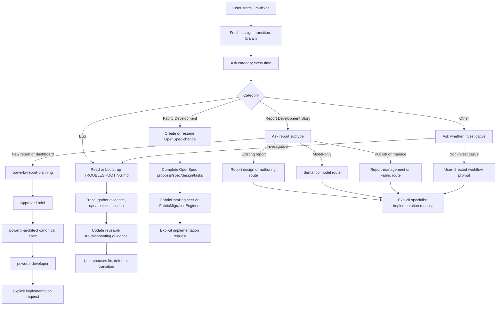

## Context

The Jira workflow currently fetches, assigns, transitions, and branches a
ticket, but it does not establish what kind of work is being started or which
planning record governs the work. The repository now has three distinct
planning models:

- Power BI new-report work uses an approved `brief.md`, then a
  `powerbi-architect` specification, then `powerbi-developer`.
- Fabric development has orchestration agents but no separate
  architect/developer pair, so OpenSpec supplies the active planning record.
- Bug and investigative work uses the repository's living
  `TROUBLESHOOTING.md` record and its documented live-evidence workflow.

The existing Jira MCP calls, branch conventions, Power BI report-planning
boundary, and troubleshooting lifecycle remain constraints.

## Goals / Non-Goals

**Goals:**

- Make user classification a mandatory, visible state after Jira and branch setup.
- Route each selected category to its correct planning and implementation workflow.
- Make planning records resumable and prevent duplicate OpenSpec changes or
  troubleshooting sections.
- Preserve explicit user authorization between planning and implementation.
- Convert resolved Bug and investigative Other work into reusable troubleshooting
  guidance.
- Keep a local, gitignored `SESSION_RESUME.md` current after every agent-created commit.

**Non-Goals:**

- Inferring a work category from Jira text without asking the user.
- Replacing the Power BI report-planning or architect contracts.
- Creating an OpenSpec bridge for Power BI specifications.
- Treating every Other request as a troubleshooting investigation.
- Changing Jira statuses, transition IDs, or MCP payloads.

## Decisions

### Architecture Diagram

### Decision: Ask the user to classify every started Jira ticket

After Jira assignment, status transition, and branch validation, the workflow
must ask the user to select exactly one of:

1. Bug
2. Report Development Story
3. Fabric Development
4. Other

The Jira summary and description are supplied as context, but they never
replace the question or silently determine the route. This avoids treating
Jira issue types or wording as reliable architectural classification.

Alternative considered: infer the route from issue type or description.
Rejected because the same Jira type can represent a report, model, Fabric,
bug, or documentation task, and connecting to live systems may require user
authorization.

### Decision: Report stories use a second subtype gate

For Report Development Story, ask whether the work is:

- a new report or dashboard;
- an existing report change;
- model-only work; or
- report publishing or management.

New reports use the existing `powerbi-report-planning` boundary:
`brief.md` approval -> `powerbi-architect` canonical specification ->
explicit `powerbi-developer` implementation. Existing report changes route to
design, authoring, architecture, semantic-model, or management specialists
based on the selected subtype and request detail.

Alternative considered: send every report story through report planning.
Rejected because report planning is explicitly for new report/dashboard
discovery and the repository preserves direct specialist routes for surgical
report, design, model, and management work.

### Decision: Use OpenSpec as the active Fabric development plan

Fabric development uses OpenSpec directly because Fabric has orchestration
agents rather than separate architect and developer agents. The workflow
creates or resumes a Jira-linked OpenSpec change, reports its status and path,
and does not invoke apply automatically. Once the plan is complete and the
user explicitly requests implementation, `FabricDataEngineer` or
`FabricMigrationEngineer` consumes the tasks and delegates endpoint work to
the applicable Fabric skills.

This applies to development changes, architecture work, migrations, and
cross-workload builds. Read-only discovery and simple operational requests
may use the direct Fabric workflow without OpenSpec unless the user requests
a durable plan.

Alternative considered: use a Power BI-style brief/spec pair.
Rejected because Fabric does not have the same separate architect/developer
contract, while OpenSpec already provides proposal, requirements, design,
tasks, status, and resumability.

### Decision: Bug and investigative Other work use TROUBLESHOOTING.md

The workflow must read the repository's `TROUBLESHOOTING.md` before
investigation, resume a matching ticket section when present, and bootstrap
the file when absent. It must not assume a semantic-model, Fabric, or other
live connection; the user or documented repository environment determines
what may be queried.

After confirming the root cause, the workflow updates one ticket-specific
section with the symptom, traced flow, evidence, root cause, status, and
actions. It then extracts reusable facts into the shared troubleshooting
environment or guidance section, such as a working connection, diagnostic
shortcut, known limitation, prevention rule, or remediation pattern.

The workflow reports findings to Jira and asks the user whether to fix, defer,
or transition the ticket. It never treats root-cause confirmation as
implementation authorization.

Alternative considered: keep findings only in Jira.
Rejected because Jira comments are not a durable repository troubleshooting
record and do not prevent repeated discovery.

### Decision: Fixes use a lightweight post-diagnosis gate, not full routing

When the user chooses "fix" after a confirmed root cause, the workflow asks
for the fix surface (Power BI report, semantic model, Fabric, or Other),
states what it intends to change, and proposes a classification. The surface
is chosen at fix time because it is unknown at Jira start.

Classification uses two blast-radius triggers, not counts. A fix is
**substantial** when it:

1. renames or removes an object that has dependents, as found by a reference
   scan (for report and model objects, the `powerbi-report-authoring`
   reference scan); or
2. introduces a new object or structural change, such as a new TMDL table,
   role, calculation group, relationship, or report page.

Every other fix is **surgical**. When the agent is unsure, it asks the user.
The user confirms or overrides the classification, and the final choice is
recorded in the ticket section.

- Surgical: hand off directly to the applicable specialist, citing the
  ticket's `TROUBLESHOOTING.md` section as the planning record.
- Substantial: escalate into the existing route for that surface (report
  architect/design, or an OpenSpec change for model/Fabric), with the
  troubleshooting section as input.

Choosing "fix" and a size selects a destination only; implementation still
requires a separate explicit request.

Alternative considered: rerun the full category routing for every bug fix.
Rejected because the troubleshooting section already records symptom, root
cause, evidence, and actions, so a mandatory second plan is redundant for
small fixes.

### Decision: Other work pauses when its route is not explicit

For Other, ask whether the request is investigative. Investigative work uses
the troubleshooting lifecycle. Non-investigative work pauses with a prompt
asking the user to describe the desired workflow, affected surface, required
tools, and whether a planning record is wanted. The agent must not invent an
architecture or implementation route.

### Decision: Planning and implementation are separate user actions

Every route reports its state and handoff location. Completing a brief,
OpenSpec change, architect specification, or troubleshooting investigation
does not start implementation. A later explicit user request is required.

Jira `In Progress`, a valid ticket branch, and a complete planning record are
all necessary context, but none alone authorizes implementation.

### Decision: Keep a local, untracked handoff after every agent-created commit

After every commit performed by the agent, update `SESSION_RESUME.md` before
continuing with post-commit Jira or pull-request handling. The update records
the commit, validation performed, active planning or implementation state, and
the next resume point. `SESSION_RESUME.md` is a local scratch file: it is
gitignored, untracked, and never staged or committed, so updating it does not
dirty the tree or trigger another commit. It is separate from the optional Jira
summary comment, which is an external communication that still requires its
own user confirmation.

Durable, shareable knowledge belongs in tracked records instead:
`MEMORY.md` for repository conventions and gotchas (updated only when a
durable fact is learned, not after every commit), plus the Jira comment,
`TROUBLESHOOTING.md`, and the OpenSpec change.

Alternative considered: keep `SESSION_RESUME.md` tracked.
Rejected because it describes one branch's transient state, goes stale on other
branches, causes merge conflicts, and leaves the working tree dirty after each
commit.

Alternative considered: update only at the end of a session.
Rejected because a commit can be followed by interruption, context loss, or a
new agent session before the end-of-session workflow runs.

### Decision: Adapt end-session.ps1 to the local handoff

`scripts/end-session.ps1` currently stages `MEMORY.md` and `SESSION_RESUME.md`
and fails when nothing is staged. It must:

- remove `SESSION_RESUME.md` from the default stage list, staging only
  `MEMORY.md` and the declared OpenSpec files;
- keep `-ResumePath` as a local-only input used to print the handoff, never
  staged;
- not fail when only the local handoff changed and there is nothing to stage,
  reporting that no publishable handoff changes exist instead.

The `MEMORY.md` "End-of-session workflow" section is updated to match, and
`SESSION_RESUME.md` is added to `.gitignore` and untracked with
`git rm --cached` in its own commit.

### Decision: Each record has one role; routes own their recovery record

| Record | Role | Tracked |
|---|---|---|
| `MEMORY.md` | What is true: durable, vendor-neutral, cold-readable project facts | yes |
| `SESSION_RESUME.md` | In-flight state, last commit, next step; a convenience only | no (local) |
| `TROUBLESHOOTING.md` | Investigation history and shared environment facts | yes |
| Route recovery record | Planned work and progress | yes |
| Jira | Ticket status and findings comments | external |

Route recovery records and their progress markers:

- New report: `specs/<JIRA>-<slug>/brief.md` and the architect specification
  (`status` and task checkboxes).
- Fabric development: `openspec/changes/<JIRA>-<slug>/` (`tasks.md` checkboxes).
- Bug, investigative Other, surgical fix: the ticket's `## <JIRA>` section in
  `TROUBLESHOOTING.md`.

`MEMORY.md` holds only facts a new AI harness needs to reconstruct the
project: true, vendor-neutral, and understandable without conversation
history. It never holds ticket status, active changes, branches, or next
steps. An agent updates it when it learns or changes such a fact.

If the machine is lost, in-flight work is recovered from the route's recovery
record, Jira, `MEMORY.md`, and the user's knowledge. No workflow step may
depend on `SESSION_RESUME.md` existing. Agents update the route's recovery
record (checkboxes or status) as work completes, not only at session end.

Jira linkage for Fabric OpenSpec changes mirrors Power BI work folders: the
Jira key is the change-name prefix (`<JIRA>-<slug>`), which is what resume
lookup matches.

### Decision: Resumability is route-specific

Before creating new planning state, the workflow searches for:

- a matching `specs/<JIRA>-<slug>/brief.md` or canonical specification for
  Power BI report work;
- a matching Jira-linked OpenSpec change for Fabric development; and
- a matching `## <JIRA>` section in `TROUBLESHOOTING.md` for investigation.

Existing records are surfaced and resumed rather than duplicated. The workflow
must report the exact path and current state of the selected record.

## Risks / Trade-offs

- [Risk] Users may consider the category prompt repetitive -> ask once per
  Jira start, provide the Jira summary/description as context, and keep the
  choices concise.
- [Risk] A report subtype may remain ambiguous -> stop after the subtype
  question rather than selecting a specialist silently.
- [Risk] Fabric OpenSpec plans may be too heavy for simple operations -> limit
  the requirement to development changes and allow direct read-only or
  operational routes.
- [Risk] Troubleshooting guidance may become stale -> update existing ticket
  sections in place and require reusable guidance extraction after resolution.
- [Risk] Duplicate planning records may be created -> perform route-specific
  discovery before any create operation.
- [Risk] Users may equate Jira `In Progress` with coding authorization ->
  report the separate routing and implementation states explicitly.

## Migration Plan

1. Update the Jira workflow skill with the mandatory category and subtype
   prompts, route-specific state model, and explicit implementation handoff.
2. Update DevOps orchestration and examples with the Power BI, Fabric, and
   troubleshooting routes.
3. Add the post-resolution reusable-guidance step to
   `troubleshooting-workflow`.
4. Add validation fixtures for every category, report subtype, resumable
   record, incomplete plan, and user cancellation path.
5. Roll back by reverting the routing orchestration and documentation while
   preserving any planning records or troubleshooting history already created.
