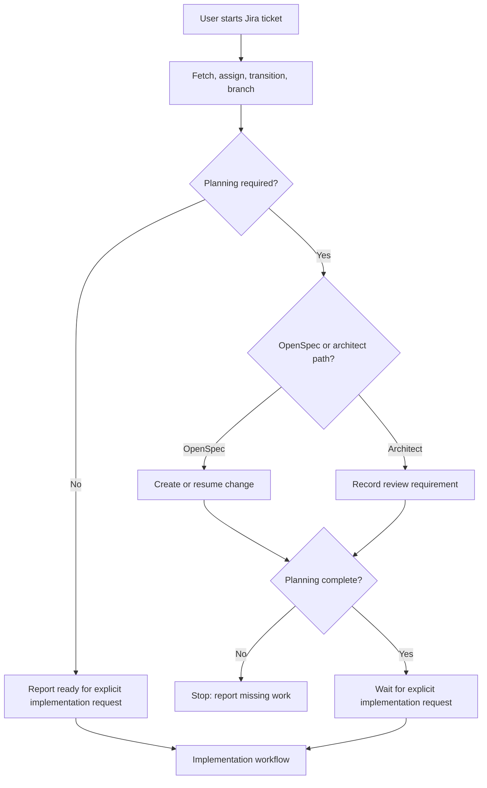

## Context

The current Jira workflow fetches, assigns, transitions, and branches a ticket, but its completion signal is effectively the branch check. The requested behavior adds a planning boundary across the DevOps workflow and OpenSpec lifecycle. The existing Jira MCP calls and branch conventions remain constraints.

## Goals / Non-Goals

**Goals:**

- Make planning a first-class state between ticket start and implementation.
- Route OpenSpec-required work into a resumable OpenSpec change.
- Keep Jira and Git setup useful without treating either as implementation approval.
- Give agents a deterministic stop point and a clear handoff to a later implementation request.

**Non-Goals:**

- Changing Jira statuses, transition IDs, or MCP payloads.
- Building a general-purpose architecture approval service.
- Automatically approving plans or starting implementation after plan generation.

## Decisions

### Architecture Diagram

### Decision: Gate after repository setup, before implementation

The workflow will retain Jira assignment, status transition, branch discovery, and branch validation as start-ticket operations. It will then evaluate planning needs before any implementation handoff. This preserves operational traceability while preventing the common inference that In Progress means coding is authorized.

Alternative considered: gate before Jira transition. Rejected because planning work still benefits from ownership and a ticket branch, and the requirement is specifically to block implementation rather than ticket intake.

### Decision: Use OpenSpec as the resumable planning record

For OpenSpec-required work, the workflow will use the OpenSpec CLI and change directory as the source of truth for planning progress. Existing matching changes must be reused or surfaced rather than duplicated. The workflow will not invoke the apply workflow automatically.

Alternative considered: keep a free-form planning note in Jira only. Rejected because it is not sufficient to drive artifact dependencies or a deterministic implementation handoff.

### Decision: Require explicit user intent for implementation

Completion of planning changes the gate state but does not start implementation in the same invocation. A later explicit implementation request is required. This preserves the OpenSpec planning boundary and prevents generated plans from being mistaken for approval to edit code.

## Risks / Trade-offs

- [Risk] Classification of planning requirements may be incomplete → use explicit ticket language, existing OpenSpec context, and the workflow's architecture review path; report uncertainty instead of silently coding.
- [Risk] Users may expect In Progress to start coding → clearly report the separate planning-gate state in the handoff.
- [Risk] Duplicate changes may be created → search for matching local OpenSpec changes before creating one and make change identity resumable.
- [Risk] Existing automation assumes start-ticket means implementation → keep the branch/Jira setup outputs stable while changing only the implementation handoff boundary.

## Migration Plan

1. Update the Jira workflow and DevOps orchestration to expose and enforce the planning gate.
2. Add tests or validation fixtures for OpenSpec-required, architect-required, incomplete, and complete planning paths.
3. Roll back by reverting the gate orchestration while preserving already-created planning artifacts; no Jira data migration is required.
