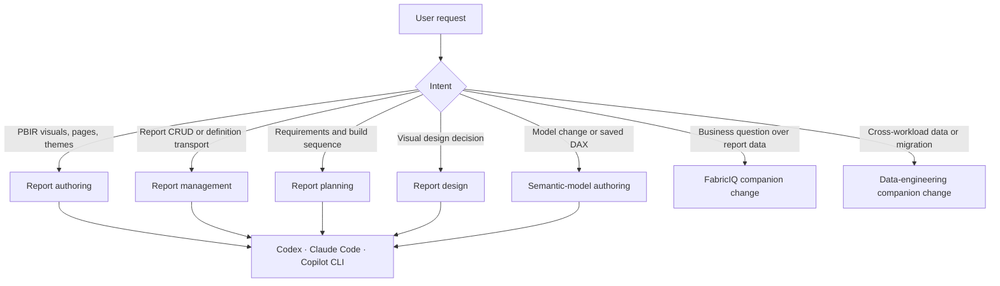

## Context

The current FIN-1810 Power BI work is captured in `plans/skill-merge-fin-1810-powerbi-authoring.plan.md`, but that document is not an OpenSpec contract. The local Power BI plugin already contains richer report-authoring resources and local-only capabilities, while upstream provides a useful comparison source and the broader Fabric skills collection supplies related data-engineering personas. This parent change establishes the Power BI behavior contract and coordinates the two focused companion changes.

## Goals / Non-Goals

**Goals:**

- Make the Power BI authoring migration explicit, testable, and coordinated with FabricIQ and the selected Fabric data-engineering slice.
- Preserve one authoritative owner for each report, model, design, planning, and data-consumption request.
- Preserve progressive disclosure and source-owned content across Codex, Claude Code, and Copilot CLI.

**Non-Goals:**

- Replacing the detailed FabricIQ or data-engineering implementation plans.
- Wholesale replacement of local Power BI skills with upstream copies.
- Importing excluded Fabric personas or unrelated upstream skills.

## Decisions

### Treat the FIN-1810 Power BI merge plan as implementation input, not the behavior contract

The existing merge plan remains the source of detailed file-level comparison and reviewed base-direction decisions. This OpenSpec adds the user-visible ownership, preservation, routing, and harness acceptance criteria that the plan lacks.

Alternative considered: use the Markdown merge plan as the only FIN-1810 artifact. Rejected because it does not provide scenario-based behavioral requirements or a formal cross-change contract.

### Keep local Power BI assets unless a reviewed comparison justifies replacement

Local report-authoring scripts, templates, reference scanning, DAX testing, and agents are retained by default. The upstream collection is a donor for validated additions and wording improvements, not an automatic replacement source.

Alternative considered: adopt all upstream Power BI skills as a wholesale base. Rejected because it would discard local capability depth and introduce source-side references that are not guaranteed to be installed.

### Make skill-quality scoring a merge gate, not an automatic merge rule

Each matched skill pair must receive the `skill-merge-planner` seven-dimension score on both sides, live `quick_validate.py` results, and an inventory of references, scripts, and assets before a disposition is selected. The score supplies evidence for a recommendation; the user's confirmed disposition remains the final decision. Validation failures and unavailable dependencies constrain the corresponding quality dimensions and must be resolved, excluded, or explicitly adapted.

Alternative considered: rely on the existing plan's recorded totals alone. Rejected because its validation outcomes were inferred, so implementation needs reproducible, live evidence.

### Coordinate with companion changes through guarded routing

`add-fabriciq-consumption-skill` owns live Power BI data consumption and MCP configuration. `port-fabric-data-engineering-capabilities` owns Fabric Data Engineer and Migration Engineer plus their skill closure. This change adds routing to those capabilities only after their availability gates pass.

Alternative considered: duplicate FabricIQ and data-engineering requirements here. Rejected because separate contracts make their preconditions and implementation independently verifiable.

## Architecture Diagram

## Risks / Trade-offs

- [The existing merge plan and this contract diverge] → Reconcile the plan's file-level dispositions against these requirements before implementation and update either artifact deliberately.
- [Companion capability is routed before installation] → Keep FabricIQ and Data Engineer/Migration Engineer redirects conditional on their completed smoke/discovery gates.
- [A multi-harness projection duplicates domain content] → Use one source-owned skill body and verify all references resolve from each harness projection.
- [Selective merge misses an upstream improvement] → Re-run the reviewed skill comparison for each affected pair before applying a replacement or deletion.
- [Score is mistaken for an automatic decision] → Record the rubric drivers, validator results, resource inventory, and user-confirmed disposition together for every matched pair.

## Migration Plan

1. Re-run live validation and reconcile the FIN-1810 Power BI scorecard, resource inventory, and user-confirmed dispositions with this OpenSpec's ownership and preservation requirements.
2. Apply the approved selective Power BI merges and validate each skill's local resources and routing.
3. Complete FabricIQ and data-engineering companion gates before enabling their redirects.
4. Project the final selected capability set to Codex, Claude Code, and Copilot CLI and run harness-specific discovery tests.
5. Roll back a merge by restoring the previous local skill version and removing only the affected companion redirect; unrelated local capability remains intact.
