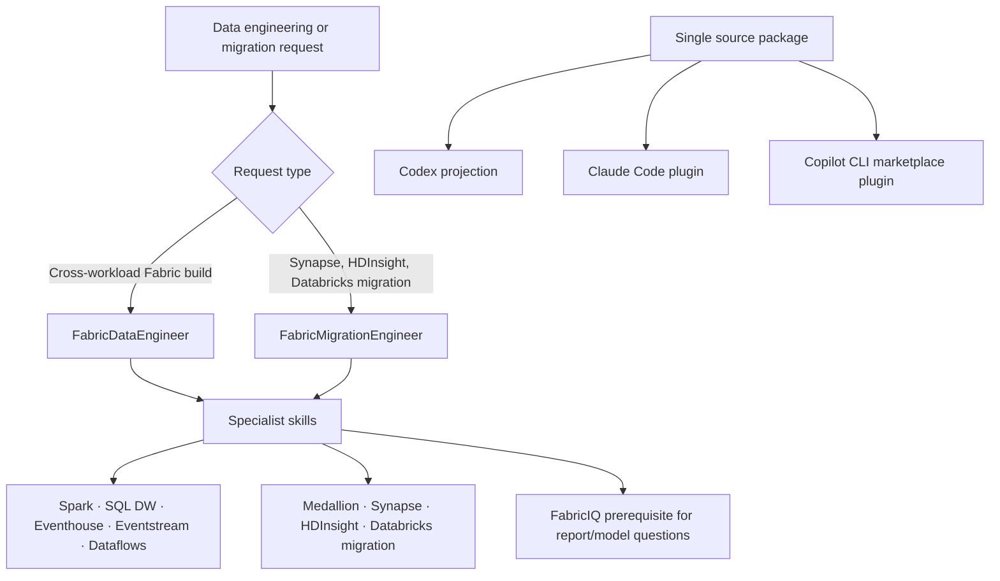

## Context

The upstream `fabric-skills` plugin provides 23 skills and four packaged personas, while the local Fabric plugin currently provides a single broad `fabric-cli` skill. This change deliberately imports only two upstream agent personas and their specialist dependency closure. The existing Power BI merge work remains separate, and the `add-fabriciq-consumption-skill` change owns FabricIQ MCP and skill implementation.

## Goals / Non-Goals

**Goals:**

- Deliver a coherent Data Engineer and Migration Engineer capability slice rather than a partial agent file with broken delegations.
- Preserve the upstream source structure where it supports progressive disclosure, while adapting only host-specific packaging and reference paths.
- Provide identical functional coverage through Codex, Claude Code, and GitHub Copilot CLI.

**Non-Goals:**

- Importing every upstream `fabric-skills` capability or persona.
- Replacing existing Power BI, DevOps, or Fabric CLI domain guidance.
- Duplicating FabricIQ implementation or treating read-only Power BI consumption as a data-engineering authoring operation.

## Decisions

### Import the dependency closure as one capability slice

The migration slice includes `FabricDataEngineer`, `FabricMigrationEngineer`, and the skills they delegate to: `spark-cli`, `sqldw-cli`, `eventhouse-cli`, `eventstream-cli`, `dataflows-cli`, `e2e-medallion-architecture`, `synapse-migration`, `hdinsight-migration`, and `databricks-migration`. `semantic-model-authoring` is coordinated with the existing Power BI skill rather than duplicated. FabricIQ remains a prerequisite supplied by its separate OpenSpec change.

Alternative considered: import all 23 upstream Fabric skills. Rejected because it would expand scope to unrelated personas and workloads without a validated need.

### Keep upstream shared references on demand

Only the `common/` documents and per-skill resources reachable from the selected dependency closure will be copied or mapped. The import will preserve explicit routing tables and avoid global instructions that force unrelated documents into every request.

Alternative considered: copy the entire upstream `common/` directory. Rejected because it adds unneeded maintenance and increases the risk of accidental context loading.

### Use source-specific adapters per harness

The source repository's marketplace/plugin conventions are the baseline: GitHub Copilot CLI marketplace metadata, Claude Code plugin metadata, and Codex skill/agent plus MCP configuration. The local installer will project the same source package to each harness and merge MCP settings without overwriting user-owned configuration.

Alternative considered: maintain independent copies of the skill and agent content for each harness. Rejected because drift would undermine behavior parity.

## Architecture Diagram

## Risks / Trade-offs

- [An agent references a skill or resource outside the approved closure] → Build a reference graph before copying; either include the required dependency or rewrite the delegation with an explicit scope decision.
- [Host-specific plugin formats diverge] → Keep domain assets source-owned and add only minimal per-harness projection/configuration adapters.
- [MCP configuration overwrites a user's servers] → Merge by server name with conflict detection and retain backups/recovery instructions.
- [FabricIQ implementation lags the agent import] → Keep FabricIQ routing guarded until `add-fabriciq-consumption-skill` is installed and its smoke test passes.

## Migration Plan

1. Build and validate the dependency graph from both agent files and selected skills.
2. Port the selected skills, reachable shared references, and agents into the local Fabric plugin.
3. Add source-to-projection catalog metadata for Codex, Claude Code, and Copilot CLI.
4. Merge required MCP configuration per harness and validate discovery plus read-only connectivity.
5. Exercise representative data-engineering and migration routing scenarios; remove the new projections and MCP entries to roll back without affecting unrelated local plugins.
