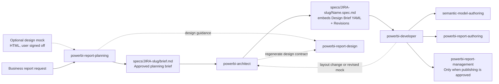
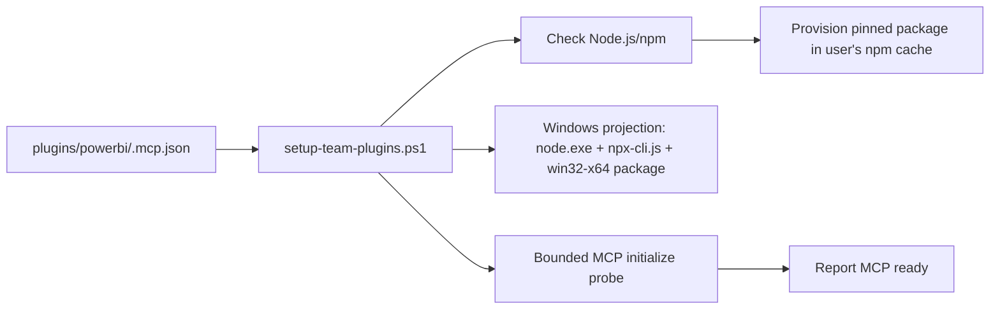

## Context

See `proposal.md` for the motivation. The current repository has two overlapping workflows:

- `powerbi-report-planning` produces `_brief/report-spec.md` and currently claims to continue through build, validation, and publishing.
- `powerbi-architect` already owns `specs/[Name].spec.md`, including EARS requirements, architecture, data sources, and executable tasks.

`powerbi-developer` consumes the latter contract: it looks for a `Tasks` section, validates task output against acceptance criteria, and writes an execution summary. The design must preserve this established execution path while making the planning brief a deliberate upstream input and carrying the detailed design contract into the specification the developer reads.

In practice a design mock (HTML, generated from sample data, a screenshot, or an existing report) is iterated with the user before planning. The architect spec is named for the work scope, not the report, so artifacts must be linked by location rather than by name.

## Goals / Non-Goals

**Goals:**

- Make planning a bounded discovery, design-intent, and approval workflow.
- Make the architect-to-developer specification the canonical implementation contract, including the design contract.
- Keep all artifacts of one work item together and discoverable.
- Preserve specialist ownership for report design, PBIR authoring, semantic-model authoring, and report management.
- Document the process where users and agents will read it.
- Make the installed GitHub Copilot plugin discoverable and fully loadable, not merely present in the extensions directory.

**Non-Goals:**

- Changing Power BI semantic-model, PBIR, report, or publishing behavior.
- Replacing the architect's specification template with the planning brief.
- Moving OpenSpec artifacts into the Power BI report-planning workflow or requiring the OpenSpec CLI in user repos.
- Building HTML mock generate/refresh/ingest/bind mechanics (follow-up `design-from-html-mockup`) or a traceability validator script.
- Supporting legacy layouts such as `_brief/report-spec.md` or flat `specs/<Name>.spec.md`.

## Architecture Diagram

The setup path for the Copilot connector is independent of the report-planning
flow but is part of the plugin's installation readiness:

## Decisions

### Decision 1: One work folder per work item

All artifacts live in `specs/<JIRA>-<slug>/` (or `specs/<slug>/`): `brief.md`, optional `mockup/`, `<Name>.spec.md`, `<Name>.plan.md`, `<Name>.ExecutionSummary.md`. The Jira key comes from the git branch, otherwise it is asked once. The architect keeps `[Name].spec.md` inside the folder so phased specs and its never-overwrite rule still work, and the developer's plan and summary naming is unchanged. The brief is fixed as `brief.md` because the folder carries identity.

**Alternatives rejected:** a fixed `_brief/report-spec.md` (cannot hold two reports); pairing brief and spec by name (the spec is named for the work scope and may differ from the report); a `Source brief` header as the only link (colocation makes it unnecessary).

### Decision 2: Planning stops at the approved brief

The planning skill ends after it writes the approved `brief.md` and gives the architect the exact path. Its model-change, PBIR-authoring, Desktop-validation, and publishing sequence is removed. The brief carries front-matter (`jira`, `report`, `status`, `mockup`), and is frozen once approved.

**Alternative rejected:** Keep the planner's end-to-end build claim. That lets a business-planning artifact bypass the architect and conflicts with the developer's task contract.

### Decision 3: Architect remains the canonical spec owner

The architect keeps its EARS requirements, design, data sources, and executable tasks, and gains a rule: a new-report specification requires an approved brief (model-only specs are exempt). Power BI-specific content such as Data Sources and the design contract does not fit OpenSpec's behavior-only `specs` and `design` artifacts, and user repos have no OpenSpec CLI, so the single portable spec file stays. `openspec-bridge` remains the optional archive layer.

**Alternative rejected:** Make `brief.md` satisfy the developer directly. It lacks technical requirements and a task plan, and forcing it to would recreate the architect template elsewhere.

### Decision 4: The Design Brief is embedded in the specification

The architect embeds the approved `Design Brief:` YAML verbatim under `Design > Report Design Contract`. EARS requirements cite it (placements inside declared regions, empty `space_audit.unplaced_regions`, a `page_title` placement, slicers in the `filters` region), and the Tasks section has one task per page with conformance to that page's `layout_contract` as acceptance criteria. From then on the spec's YAML is the only authoritative design; the brief and the mock are non-authoritative references. Changes regenerate the block through `powerbi-report-design`.

**Alternative rejected:** Reference the brief's YAML by path. That leaves two copies that can drift and makes the developer read an artifact that is not its contract.

### Decision 5: Amendments use a Revisions section

Borrowing OpenSpec's delta pattern, the spec template gains a `Revisions` section listing ADDED, MODIFIED, and REMOVED pages and requirements. The architect adds tasks only for the delta and never resets or silently alters completed tasks, which preserves the developer's resume-from-first-unchecked logic.

### Decision 6: The design mock is an optional, non-gating input

Planning accepts a user-finalized HTML mock; sign-off on it counts as design approval, so planning approval covers scope, field bindings, and translation notes. Mock fields without a model counterpart become model requirements. The mock may be revised later as a communication aid; it only gains authority when the architect is asked to update the spec from it, and the spec records the mock provenance. Mechanics are a follow-up, so READMEs present the mock as optional.

**Alternative rejected:** Treat the mock as a prerequisite gate. Not every report has one and OpenSpec's own model treats dependencies as enablers.

### Decision 7: The developer consumes the embedded contract

The developer extracts the embedded block for report-page tasks and passes it to `powerbi-report-authoring`. If it is missing, the developer stops and asks the architect. Layout changes go through the architect. Plan and summary paths derive from the spec's folder.

### Decision 8: Enforcement lives in the agents, the READMEs state the process

The plugin README and the root README describe the full flow, folder layout, and ownership. The architect and developer rules enforce the same process, so documentation and behavior agree.

### Decision 9: Copilot discovery and skill loading are separate gates

GitHub Copilot validation uses the current `copilot plugin list` subcommand for
non-interactive checks; `/plugin list` remains an interactive-session command only.
Validation must also run `copilot skill list`, because a plugin can appear as installed
while one of its skills is rejected during loading. Skill frontmatter descriptions are
kept at or below Copilot's 1,024-character limit, and setup validation reports both
plugin discovery and skill-load failures explicitly.

**Alternative rejected:** Treating plugin registration as sufficient. Copilot can
recognize an installed plugin while omitting an invalid skill, leaving the planning
workflow partially available.

### Decision 10: MCP registration, provisioning, and readiness are separate gates

The repository keeps a portable MCP declaration under `plugins/powerbi/.mcp.json`,
but setup generates a host-specific projection before installing it. On Windows
x64, setup resolves the pinned platform package
`@microsoft/powerbi-modeling-mcp-win32-x64@1.0.0`, launches npm through
`node.exe` and `npx-cli.js`, and uses the user's npm cache. Each user therefore
downloads and caches their own copy; the repository does not contain or reference
the VS Code extension's installation directory. Setup must also perform a bounded
MCP `initialize` exchange before reporting the connector as ready.

The direct Node launcher is intentional. The Windows `npx.cmd` batch shim can
fail Copilot's suspended-child-process inspection with an access-denied error,
while `node.exe` with npm's `npx-cli.js` avoids that host-specific failure.
The pinned version keeps installations reproducible; updating it is an explicit
repository change rather than an implicit `latest` lookup.

**Alternative rejected:** Registering the VS Code extension executable or storing
an absolute extension path in the repository. That would only work for users with
the same extension installation and would make the team setup non-portable.

**Alternative rejected:** Treating package provisioning or plugin discovery as
proof that the MCP is usable. A package can be cached or a plugin can be listed
while process launch or MCP initialization still fails.

## Risks / Trade-offs

- [Existing users expect planning to build immediately] -> State the planning-only boundary in the skill description, approval output, and README; require a separate implementation request after the spec is ready.
- [The brief becomes too thin to support architecture] -> Require model context, scope, page intent, design direction, dependencies, constraints, risks, and approval status in the brief template.
- [Stale references still call `_brief/report-spec.md` canonical] -> Sweep the authoring and design skills, READMEs, and spec-lifecycle docs; validate that only the architect spec is described as canonical for developer execution.
- [A new-report request bypasses planning] -> The architect routes it to planning first; surgical authoring and design-only requests keep their direct routes.
- [Large specs for multi-page reports] -> Accepted; the embedded YAML is the price of a single authoritative contract.
- [The mock drifts from the spec] -> Accepted by design; the spec records mock provenance and the spec's YAML prevails.
- [READMEs overstate mock tooling] -> The README states the mock is optional and does not describe unreleased mechanics.
- [Copilot reports an installed plugin even when a bundled skill fails to load] -> Validate both `copilot plugin list` and `copilot skill list`, enforce the description-length limit, and fix the rejected skill before declaring the plugin healthy.

## Migration Plan

1. Rewrite `powerbi-report-planning/SKILL.md` and replace the report-spec template with the `brief.md` template, including the work-folder rules and mock input.
2. Update the architect agent and its `.toml`: brief requirement, work folder, embedded contract, `Revisions` section.
3. Update the developer agent and its `.toml`: embedded contract, stop rule, path derivation.
4. Update stale references in the authoring and design skills and the spec-lifecycle docs.
5. Update `plugins/powerbi/README.md` and the root `README.md` with the process.
6. Update Copilot setup verification to use `copilot plugin list`, add a complete skill-load check, and validate MCP package provisioning, the Windows host projection, and MCP `initialize` readiness.
7. Shorten any bundled skill frontmatter description rejected by Copilot, then validate with `copilot plugin list`, `copilot skill list`, a clean-profile/package-provisioning check, the generated MCP projection and initialize probe, the Codex projection and catalog scripts, skill frontmatter and path checks, and `openspec validate --strict`.

Rollback is a documentation-only revert of the affected skills, agents, and READMEs; no runtime data or report artifacts are changed.

## Open Questions

None. The mock mechanics and the traceability validator are explicitly deferred to follow-up changes.
